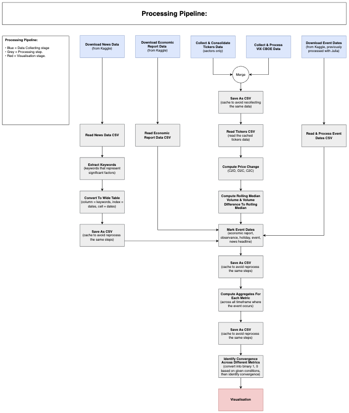
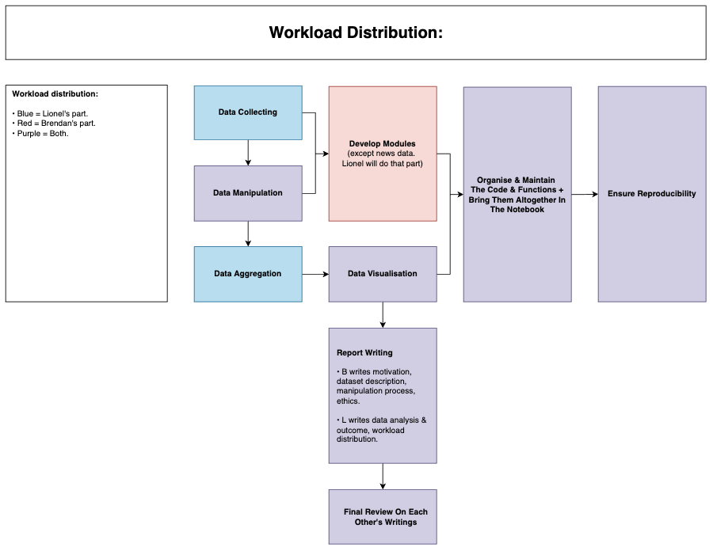

# __MADS M1 Analysis Of Price Sensitivity To Various Factors__ 

## __Project Purpose__

Analyse price sensitivity of different sector to multiple factors. Sectors include: 

ETF | Description. 
--- | ---
XLF | Finance.
XHB | Homebuilder.
XLK | General tech.
XLY | Discretionary.
XLP | Staple.
XRT | Retail.
XLI | Industrial.
XLB | Basic materials.
XLU | Utilities.
XLE | Energy.

--- 

## __Folder Structure__

Folder Name | Description
--- | ---
config | For parameter configuration. 
modules | Contain all the custom classes and functions. 
notebook | Contain all the data processing steps and visualisation. 
pipfile | For setting up the `pipenv` and tracking all the installed dependencies. 

---

## __Notebook Content__

Notebook Name | Description
--- | ---
preprocessing_steps | Contain the step by step processing workflow before organising them into classes & functions. 
explore_visualisation | Just for visualisation exploration. 

--- 

## __Guide On Initial Setup__

1.  Clone the repo to your directory and create a new branch. 

    ```
    git clone https://github.com/lioneltayyd/MADS-M1-analysis-of-price-sensitivity-to-various-factors.git; 
    git checkout -b dev-name;
    cd MADS-M1-analysis-of-price-sensitivity-to-various-factors/; 
    git add .; 
    git commit -m "Initiate a new branch."; 
    git push origin; 
    ```

1.  Ensure that you are using python 3.8.5 to avoid any code or dependencies 
    conflict due to version difference. 
    
    Options to download python: 

    -   https://www.python.org/downloads/
    -   https://docs.conda.io/en/latest/miniconda.html (python 3.8) 
    -   https://github.com/pyenv/pyenv#installation 

1.  Run this command to install `pipenv` package. You need to package to 
    install the python packages and dependencies. 

    ```bash
    pip install pipenv; 
    ```

    Ensure that `pipenv` is installed by running `pipenv --version`. 

1.  Next, run the following to activate the virtual environment. All your packages 
    will only made available within this environment. The `pipenv sync` is to ensure 
    that pipenv should match the exact version when installing the packages. 

    ```bash
    pipenv shell && pipenv sync; 
    ```

1.  Install `Jupyter` extension on your VSCode or alternative IDE to enable running 
    the notebook directly on your VSCode without installing `jupyter notebook`. 

1.  For VSCode users, press CMD + SHIFT + P and type `Reload Window` to reload the window after installing
    the python packages. Then repeat the previous step and type `Select Interpreter` to 
    select the python interpreter `MADS-M1-analysis-of-price-sensitivity-to-various-factors` 
    to run the notebook. 

--- 

## __Processing Workflow & Workload Distribution Diagram__

You can access `processing_flowchart.html` inside the `docs` folder to view the diagrams. There are 2 pages in total. 

 

 
